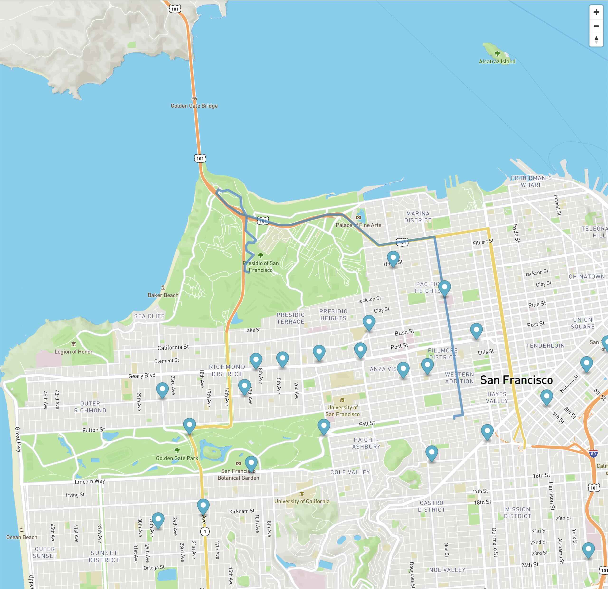
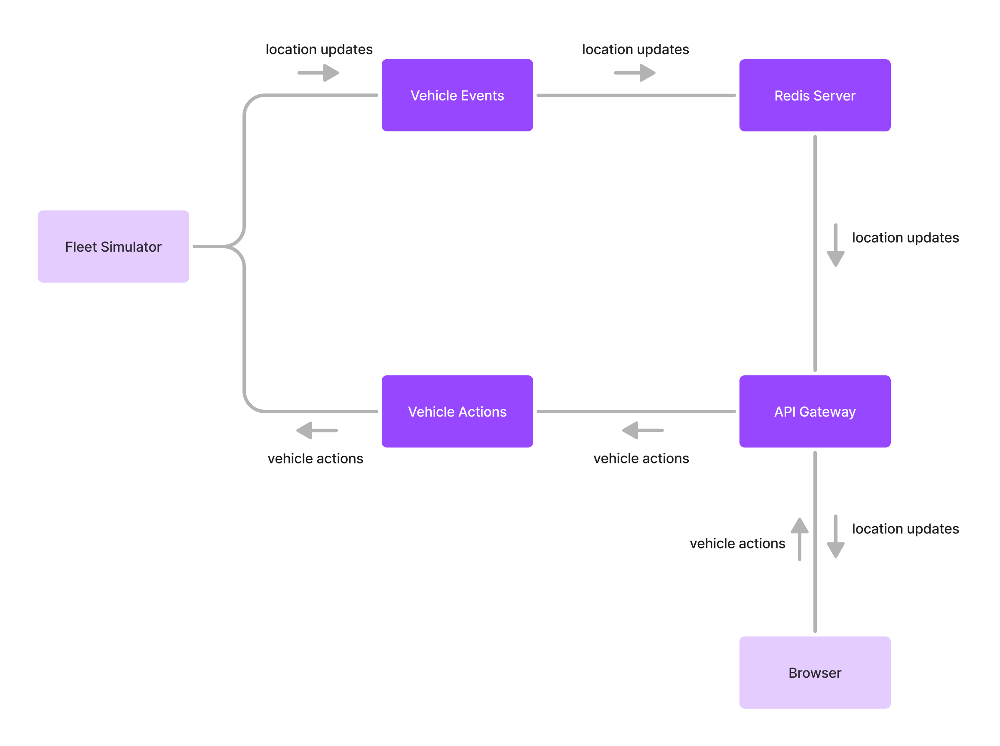

# Autonomous Research

Research before the full-fledged autonomous project. Here's a screenshot of the
current state of the app. Note that the app shows the route of the selected
vehicle from the starting point to the destination.



## Architecture



## Prerequisites for development

1. [Node Version Manager](https://github.com/nvm-sh/nvm) (nvm) - allows using
   different versions of node via the command line

## Getting Started

```shell
nvm use        # use the required version of node
npm ci         # install dependencies
npm run build  # build all packages
npm run dev    # run apps

# in a separate shell
npm run storybook
```

Open browser windows at the following URLs to see the respective apps:

1. http://localhost:3000/: Autonomous Research
2. http://localhost:6006/: Storybook

> Note: Do not run `npm install` or `npm ci` in any of the subdirectories. It
> will break the build. There should be only one `package-lock.json` file in the
> entire repo (at the root).

## All Commands

```
npm ci                   # install dependencies
npm run build            # builds all workspaces
npm run ci-validate      # builds, lints, formats, and tests all code (runs in CI pipeline, don't run locally)
npm run clean            # deletes all build artifacts
npm run commit           # displays commit helper prompt to ensure your commits use conventional commits
npm run dev              # run app
npm run fix              # lints, formats and attempts to fix any issues (requires `npm run build` has been ran)
npm run format           # formats all workspaces, useful for debugging format issues (generally `npm run fix` is preferred)
npm run lint             # runs the linter on all workspaces, useful for debugging lint issues (generally `npm run fix` is preferred)
npm run storybook        # runs storybook
npm run test             # runs full build, lint, format, and all tests - run before pushing to remote
```

## Common Workflows

### Creating New Components

Use [Code Shaper](https://www.code-shaper.dev/) to create new components. This
will give you a good starting point that is consistent with React best
practices.

Here's an example of creating a component called `EventList` using Code Shaper:

```sh
$ npx shaper
? Which plugin would you like to run? React (@code-shaper/react - generates React applications)
? Which generator would you like to run? component (generates a component)
? Component name? (e.g. TextField) EventList
? Which workspace should this go to? apps/autonomous-research
? Parent directory within workspace? src/components/EventList

Creating EventList...
  EventList.stories.tsx
  EventList.test.tsx
  EventList.tsx
  index.ts

Done.
```

### Production build

To build all packages and apps for production, run the following command:

```shell
npm ci
npm run build
```

### Clean build

Removes all build artifacts and performs a clean build. Run these steps before
pushing to remote.

```shell
npm run clean
nvm use
npm ci
npm run build
npm run fix
npm test
```

For an "aggressive" clean build, add a step to remove the `package-lock.json`
file as shown below. This will build the lock file from scratch.

```shell
npm run clean
nvm use
rm package-lock.json
npm install
npm run build
npm run fix
npm test
```

### Running unit tests

The following command runs a full build, lint, format, and all tests. However,
it uses the Turborepo cache to skip steps that have no changes since the last
run. Hence it is very efficient. **Always run this command before pushing to
remote.**

```shell
npm test
```

### Running end-to-end tests using dev build

```shell
npm run dev # starts a local server hosting the react app

# run e2e tests non-interactively (run in a different shell)
npm run e2e

# run e2e tests in the Playwright user interface (run in a different shell)
npm run e2e:ui
```

### Linting, formatting and fixing coding issues

```shell
npm run fix
```
